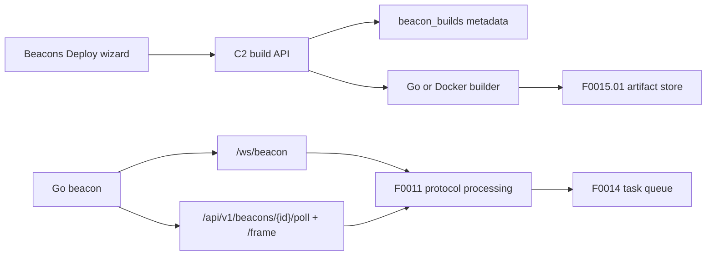

# F0015: Go Beacon Agent

## Metadata
| Field | Value |
|---|---|
| Feature Number | F0015 |
| Description | Implement a real Go beacon with binary protocol transports, shell task execution, and deploy-build workflow. |
| Summary | Adds `platform/beacons/go/`, WebSocket primary transport, long-poll fallback, shell task execution, C2 build APIs, artifact metadata, and the Beacons Deploy wizard. |
| Value | Operators can build and run a real lab beacon that registers through the F0011 protocol, receives F0014 shell tasks, and reports lifecycle status without waiting for later result-storage features. |
| Story Points | 8 |
| Priority | P0 |
| Status | Complete |
| MVP Phase | 2 |
| Dependencies | F0011, F0012, F0013, F0014, F0015.01-AMD |

## Use Cases
- An operator builds a Linux or Windows amd64 Go beacon from Beacons > Deploy.
- A lab beacon registers over `/ws/beacon`, receives a shell task from the Command queue, and returns `running` then `completed` or `failed`.
- A registered beacon falls back to long-poll when WebSocket transport is unavailable.
- A reviewer validates protocol compatibility with Go unit tests and C2 fake-build tests without requiring local Go.

## Assumptions
- No stealth, persistence, privilege escalation, service install, or auto-start behavior is included.
- C2 stores task lifecycle and protocol receipts only; stdout, stderr, exit codes, chunks, downloads, and result UI remain F0017.
- Direct C2 transport is required in F0015. Handler URL compatibility is config-shaped only; handler tunneling remains F0038/F0039.
- Build APIs are disabled by default outside explicitly enabled development/test configurations.
- Local Go is optional because CI commands fall back to Docker `golang:1.26`.
- Build metadata is stored in C2 Postgres and build artifacts are stored through the F0015.01-AMD MinIO/S3-compatible artifact store.
- Artifact downloads use OS-specific filenames (`.bin` for Linux, `.exe` for Windows), while the Deploy wizard displays artifact titles without those file extensions.
- The Deploy wizard keeps direct object-store details hidden; operators download artifacts only through authenticated C2 endpoints.

## Architecture

## Stages

### Stage 1: Beacon Scaffold And Config
**Scope:** Go module, config precedence, runtime metadata, runtime state, graceful main entrypoint.

**Acceptance Criteria:**
- [x] `platform/beacons/go` builds and tests through local Go or Docker fallback.
- [x] Config precedence is compile-time defaults, JSON file, then environment overrides.
- [x] Runtime state stores `beacon_id` and token separately with restrictive file permissions.
- [x] SIGINT/SIGTERM cancel the beacon loop cleanly.

### Stage 2: Protocol And Transports
**Scope:** Protocol client, WebSocket register/reconnect, long-poll fallback, REST cold-start fallback only when configured.

**Acceptance Criteria:**
- [x] New beacons register over WebSocket with encrypted `REGISTER`.
- [x] Existing beacons reconnect with saved `beacon_id` plus token.
- [x] WebSocket failure after registration can fall back to long-poll.
- [x] Protocol ACK/TASK frames decode through the shared Go protocol package.

### Stage 3: Shell Task Execution
**Scope:** Shell-shaped task runner and `TASK_RESULT` lifecycle frames.

**Acceptance Criteria:**
- [x] `auto`, `cmd`, `powershell`, and `bash` shell types are mapped.
- [x] Beacon sends `running` before execution and terminal status after execution.
- [x] `TASK_RESULT` includes stdout, stderr, exit code, timed out, and truncated fields.
- [x] Output is capped per stream, defaulting to 64 KiB.
- [x] C2 updates task status only and does not persist result bodies before F0017.

### Stage 4: Build API And Deploy Wizard
**Scope:** C2 build metadata/API, controlled build execution, ignored artifacts, and Beacons Deploy wizard.

**Acceptance Criteria:**
- [x] C2 exposes authenticated build targets, list, create, detail, and artifact download endpoints.
- [x] Test mode uses a deterministic fake builder; enabled development uses local Go or Docker `golang:1.26`.
- [x] Build metadata is persisted in `beacon_builds`.
- [x] Docker C2 persists build artifacts in MinIO through F0015.01 and reports missing artifacts separately from succeeded metadata.
- [x] Deploy wizard supports target, profile, connection, config-mode review, status, failures, and artifact download.

### Stage 5: Validation And Completion
**Scope:** OpenAPI, docs, CI, frontend, Go compatibility, Docker, Playwright/browser validation.

**Acceptance Criteria:**
- [x] Backend lint/unit/behave/integration pass.
- [x] OpenAPI export/check pass.
- [x] Go protocol and Go beacon test/build commands pass.
- [x] Frontend lint/unit/build pass.
- [x] Docker BFF and C2 config/build sanity pass.
- [x] Playwright/browser deploy wizard and beacon tasking sanity pass.

## Test Plan

### Go Unit Tests
- [x] Config precedence.
- [x] State persistence.
- [x] Jitter bounds.
- [x] Protocol register/heartbeat/task/result encoding.
- [x] WebSocket reconnect and long-poll fallback.
- [x] Shell success, timeout, output truncation, and unsupported shell.

### Backend Unit Tests
- [x] Build API auth and validation.
- [x] Disabled-build behavior.
- [x] Fake builder success/failure and artifact download auth.
- [x] Build metadata persistence.
- [x] C2 task lifecycle remains status-only despite result output fields.

### Integration Tests
- [x] Compose C2 registers Go beacon.
- [x] Queued shell task completes within one sleep cycle.
- [x] C2 restart triggers reconnect or re-register.
- [x] WebSocket failure falls back to long-poll.
- [x] Build API creates artifacts or uses a test fake where Docker is unavailable.

### Frontend And E2E Tests
- [x] Deploy wizard loading, error, building, success, and failure states.
- [x] Target/profile/config validation.
- [x] Artifact download action.
- [x] Beacons detail continues showing sleep, jitter, profile, protocol, and transport values.
- [x] Playwright covers login/connect C2, deploy build, beacon register, task queue, and responsive wizard sanity.
