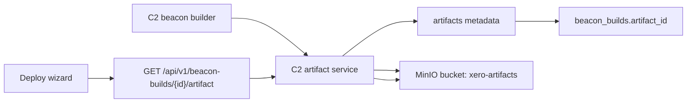

# F0015.01-AMD: MinIO Artifact Storage

## Metadata
| Field | Value |
|---|---|
| Feature Number | F0015.01-AMD |
| Description | Add a shared MinIO/S3-compatible artifact store for C2-managed build and output artifacts. |
| Summary | Introduces a generic C2 artifact storage layer, `artifacts` metadata, MinIO in the local C2 Docker stack, and beacon-build artifact storage through authenticated C2 proxy downloads. |
| Value | Gives beacon builds and future large-output features a durable local object store instead of ad hoc service-local paths. |
| Story Points | 3 |
| Priority | P0 Amendment |
| Status | Complete |
| MVP Phase | 2 |
| Dependencies | F0015, F0005, F0048 |

## References
- [AWS Boto3 S3 client documentation](https://docs.aws.amazon.com/boto3/latest/reference/services/s3.html)
- [MinIO S3 API compatibility](https://docs.min.io/aistor/developers/s3-api-compatibility/)

## Use Cases
- A C2 beacon build stores its binary in local MinIO and remains downloadable after the C2 API container is recreated.
- An operator downloads a build artifact through the authenticated C2 endpoint without receiving direct S3 or MinIO credentials.
- Later result collection, file transfer, report export, payload generation, and build-server features reuse the same artifact metadata and object-store boundary.

## Assumptions
- MinIO is the default Docker/local C2 artifact backend.
- Existing local filesystem build records and artifacts are not migrated.
- Test mode may use the filesystem backend to avoid requiring MinIO in unit tests.
- C2 remains the only authenticated operator download surface in this amendment; presigned URLs are deferred.
- External AWS S3 can use the same S3-compatible settings later, but local validation targets MinIO first.

## Architecture

## Public Interfaces And Config
- Existing beacon-build list, detail, create, and artifact download response shapes are preserved.
- Artifact downloads remain proxied through authenticated C2 endpoints.
- Default Docker/local backend: `C2_ARTIFACT_STORAGE_BACKEND=s3`.
- MinIO endpoint: `C2_ARTIFACT_S3_ENDPOINT_URL=http://c2-minio:9000`.
- Default bucket: `C2_ARTIFACT_S3_BUCKET=xero-artifacts`.
- Default prefix: `C2_ARTIFACT_S3_PREFIX=c2`.
- Local MinIO ports: `${C2_MINIO_API_PORT:-9000}:9000` and `${C2_MINIO_CONSOLE_PORT:-9001}:9001`.
- Production and non-local modes reject the default MinIO credentials.
- C2 readiness includes artifact-store availability.

## Stages

### Stage 1: Artifact Storage Boundary
**Scope:** Generic C2 artifact store abstraction and metadata table.

**Acceptance Criteria:**
- [x] Filesystem and S3-compatible backends implement put, head, get, and delete.
- [x] C2 `artifacts` metadata records namespace, owner, filename, content type, size, checksum, backend, bucket, and object key.
- [x] Beacon builds link to artifact records through `beacon_builds.artifact_id`.

### Stage 2: Beacon Build Integration
**Scope:** Replace beacon build filesystem writes with artifact-store writes.

**Acceptance Criteria:**
- [x] Completed beacon builds write objects under `c2/beacon-builds/{build_id}/{filename}` by default.
- [x] Existing beacon-build response fields remain shape-compatible.
- [x] Downloads stream through authenticated C2 endpoints with OS-specific filenames.
- [x] Missing objects produce `artifact_available=false` and `404` downloads without a 500.

### Stage 3: Local MinIO Stack
**Scope:** Docker/local C2 object storage.

**Acceptance Criteria:**
- [x] `docker-compose.c2.yml` includes MinIO with API and console ports.
- [x] C2 compose uses S3 artifact settings pointed at MinIO.
- [x] The old `xero_c2_beacon_artifacts` volume is not part of the default stack.
- [x] C2 readiness fails when the configured artifact backend is unavailable.

### Stage 4: Documentation And Future Dependencies
**Scope:** Feature index, F0015 amendment note, architecture docs, and future feature notes.

**Acceptance Criteria:**
- [x] F0015 documents that build artifacts are stored through F0015.01.
- [x] Architecture docs include `artifacts` and local MinIO.
- [x] F0017, F0029, F0072, F0073, F0081, F0107, and F0207 reference the shared artifact store where they need large durable artifacts.

## Test Plan

### Unit Tests
- [x] Artifact store put, head, get, and delete behavior with filesystem backend.
- [x] Beacon build completion creates an artifact row and object key.
- [x] Download returns the correct filename, size, checksum metadata, and auth behavior.
- [x] Missing object returns `404` and `artifact_available=false`.
- [x] Production rejects default artifact credentials.

### Compose And Static Tests
- [x] C2 compose includes MinIO service, MinIO volume, API/console ports, and C2 artifact env.
- [x] C2 compose no longer depends on `xero_c2_beacon_artifacts`.

### Integration Tests
- [x] Docker C2 starts with MinIO, creates or uses the bucket, builds a beacon, and downloads it.
- [x] Recreating `c2-api` does not lose artifacts.
- [x] Deleting the MinIO object makes the build unavailable without a 500.

### Browser Validation
- [x] Beacons Deploy build/download flow succeeds against the Docker C2 stack.
