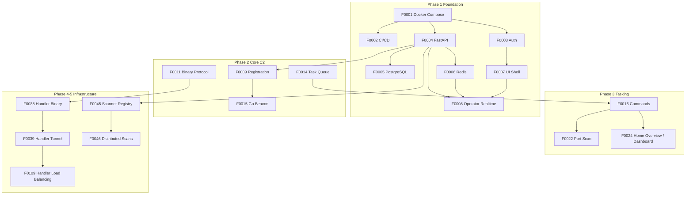

# Xero Feature Index

Numbered implementation backlog for Xero. Features are developed in order where practical; dependencies must be satisfied before starting a dependent feature.

**Template:** [_template.md](_template.md)

## Current Alignment Notes

- F0001-F0010 are complete.
- The current UI/BFF stack and separate C2 stack are documented in F0001 and the architecture docs.
- The current UI navigation is Home, Projects, Recon, Beacons, planned Reporting, planned Inventory, planned Assets, Settings, and separated Health.
- F0008 adds direct-to-C2 operator realtime over `/ws/operator`; F0009 completes the beacon registration contract and the initial C2-backed Beacons registry view; F0010 completes beacon heartbeat, stale/offline transitions, and active/offline UI counts.
- The C2 backend is the default embedded beacon handler and embedded scanner; external handler/scanner fleets, distributed scan orchestration, and beacon pivot scanning/proxying are planned features.

## Dependency Overview

F0005 completes the shared PostgreSQL persistence foundation; F0009 completes the beacon registration table and opaque token material; F0010 completes beacon heartbeat profile fields and `beacon_events`, while session/task/asset/handler/plugin domain persistence remains with dependent feature specs.
F0006 completes the shared Redis foundation; F0008 completes operator WebSocket delivery through Redis pub/sub, while real task queues remain with F0014.
Scanner modules use the embedded C2 scanner by default; external scanner registration, distributed scan sharding, and beacon pivot execution are planned in F0045-F0047.

## Phase 1 - Foundation (Weeks 1-2)

| ID | Feature | Priority | Depends |
| :--- | :--- | :--- | :--- |
| F0001 | [Docker Compose Infrastructure](0001-docker-compose-infrastructure.md) | P0 | - |
| F0002 | [CI/CD Pipeline](0002-cicd-pipeline.md) | P0 | F0001 |
| F0004 | [FastAPI Backend Foundation](0004-fastapi-backend-foundation.md) | P0 | F0001 |
| F0005 | [PostgreSQL Persistence](0005-postgresql-persistence.md) | P0 | F0001, F0004 |
| F0006 | [Redis Message Bus](0006-redis-message-bus.md) | P0 | F0001, F0004 |
| F0003 | [Operator Authentication](0003-operator-authentication.md) | P0 | F0001 plus auth persistence scaffolding |
| F0007 | [React UI Shell](0007-react-ui-shell.md) | P0 | F0001, F0003 |

## Phase 2 - Core C2 (Weeks 3-4)

| ID | Feature | Priority | Depends |
| :--- | :--- | :--- | :--- |
| F0008 | [Operator WebSocket Realtime](0008-operator-websocket-realtime.md) | P0 | F0004, F0006, F0007 |
| F0009 | [Beacon Registration](0009-beacon-registration.md) | P0 | F0004, F0005 |
| F0010 | [Beacon Heartbeat & Keepalive](0010-beacon-heartbeat-keepalive.md) | P0 | F0009 |
| F0011 | [Beacon Binary Protocol](0011-beacon-binary-protocol.md) | P0 | F0004 |
| F0012 | [Beacon WebSocket Transport](0012-beacon-websocket-transport.md) | P0 | F0009, F0011 |
| F0013 | [Beacon HTTP Long-poll Fallback](0013-beacon-http-longpoll-fallback.md) | P0 | F0009, F0011 |
| F0014 | [Task Queue](0014-task-queue.md) | P0 | F0006, F0009 |
| F0015 | [Go Beacon Agent](0015-go-beacon-agent.md) | P0 | F0011-F0014 |

## Phase 3 - Tasking, Sessions, Scanning, UI (Weeks 5-6)

| ID | Feature | Priority | Depends |
| :--- | :--- | :--- | :--- |
| F0016 | [Command Execution](0016-command-execution.md) | P0 | F0014, F0015 |
| F0017 | [Result Collection](0017-result-collection.md) | P0 | F0016, F0005 |
| F0018 | [Interactive Shell Session](0018-interactive-shell-session.md) | P0 | F0016, F0017 |
| F0019 | [File Browser Session](0019-file-browser-session.md) | P0 | F0016, F0017 |
| F0020 | [Registry Editor Session](0020-registry-editor-session.md) | P0 | F0016, F0017 |
| F0021 | [Traffic Shaping Profiles](0021-traffic-shaping-profiles.md) | P0 | F0015, F0011 |
| F0022 | [Port Scanning Module](0022-port-scanning-module.md) | P0 | F0016 |
| F0023 | [Service Enumeration Module](0023-service-enumeration-module.md) | P0 | F0022 |
| F0024 | [Home Overview / Dashboard UI](0024-dashboard-ui.md) | P0 | F0007, F0008, F0009 |
| F0025 | [Beacon Management UI](0025-beacon-management-ui.md) | P0 | F0024, F0009 |
| F0026 | [Task Execution UI](0026-task-execution-ui.md) | P0 | F0024, F0016 |
| F0027 | [Realtime Results UI](0027-realtime-results-ui.md) | P0 | F0008, F0017 |
| F0028 | [Inventory / Module Browser UI](0028-module-browser-ui.md) | P0 | F0024, F0022 |

## Phase 4-5 - Assets, Handlers, Plugins (Weeks 7-10)

| ID | Feature | Priority | Depends |
| :--- | :--- | :--- | :--- |
| F0029 | [File Transfer](0029-file-transfer.md) | P0 | F0016, F0015 |
| F0030 | [Asset Inventory](0030-asset-inventory.md) | P1 | F0005, F0009 |
| F0031 | [Automatic Asset Grouping](0031-automatic-asset-grouping.md) | P1 | F0030 |
| F0032 | [Manual Asset Grouping](0032-manual-asset-grouping.md) | P1 | F0030 |
| F0033 | [Asset Management UI](0033-asset-management-ui.md) | P1 | F0030, F0032 |
| F0034 | [Network Topology View](0034-network-topology-view.md) | P1 | F0030, F0024 |
| F0035 | [SMB Enumeration](0035-smb-enumeration.md) | P1 | F0016 |
| F0036 | [LDAP Enumeration](0036-ldap-enumeration.md) | P1 | F0016 |
| F0037 | [DNS Enumeration](0037-dns-enumeration.md) | P1 | F0016 |
| F0038 | [Connection Handler Binary](0038-connection-handler-binary.md) | P1 | F0011 |
| F0039 | [Handler Tunnel to C2 Backend](0039-handler-tunnel-to-core.md) | P1 | F0038, F0004 |
| F0040 | [Handler Traffic Masking](0040-handler-traffic-masking.md) | P1 | F0038, F0021 |
| F0041 | [Plugin API](0041-plugin-api.md) | P1 | F0016, F0004 |
| F0042 | [Python Plugin Reference](0042-python-plugin-reference.md) | P1 | F0041 |
| F0043 | [Plugin Hot-reload](0043-plugin-hot-reload.md) | P2 | F0041, F0015 |
| F0044 | [Ad-hoc Handler Installation](0044-adhoc-handler-installation.md) | P2 | F0038, F0029, F0015 |
| F0045 | [Scanner Worker Registry](0045-scanner-worker-registry.md) | P1 | F0004, F0005, F0006, F0007 |
| F0046 | [Distributed Scan Orchestration](0046-distributed-scan-orchestration.md) | P1 | F0022, F0045, F0017 |
| F0047 | [Beacon Pivot Scanning and Proxying](0047-beacon-pivot-scanning-and-proxying.md) | P2 | F0015, F0016, F0046 |
| F0109 | [Handler Load Balancing](0109-handler-load-balancing.md) | P1 | F0038, F0039, F0010 |

## Post-MVP v2

| ID | Feature | Priority | Depends |
| :--- | :--- | :--- | :--- |
| F0101 | [Process Injection & Token Impersonation](0101-process-injection-token-impersonation.md) | v2 | F0015 |
| F0102 | [Credential Harvesting Modules](0102-credential-harvesting-modules.md) | v2 | F0016 |
| F0103 | [Lateral Movement Modules](0103-lateral-movement-modules.md) | v2 | F0016, F0102 |
| F0104 | [Operator MFA](0104-operator-mfa.md) | v2 | F0003 |
| F0105 | [Multi-role RBAC](0105-multi-role-rbac.md) | v2 | F0003 |
| F0106 | [Plugin Marketplace](0106-plugin-marketplace.md) | v2 | F0041 |
| F0107 | [Additional Beacon Languages](0107-additional-beacon-languages.md) | v2 | F0011, F0015 |
| F0108 | [Memory-only Beacon Execution](0108-memory-only-beacon-execution.md) | v2 | F0015 |
| F0110 | [RabbitMQ Message Bus](0110-rabbitmq-message-bus.md) | v2 | F0006 |

## Testing Requirements

Every feature spec includes:

1. **Unit tests** - isolated module/function coverage.
2. **System/integration tests** - Docker Compose and API/beacon flows.
3. **Playwright tests** - operator-visible UI validation.

A feature is **Complete** only when all stage acceptance criteria, feature acceptance criteria, and test plan items pass in CI.
